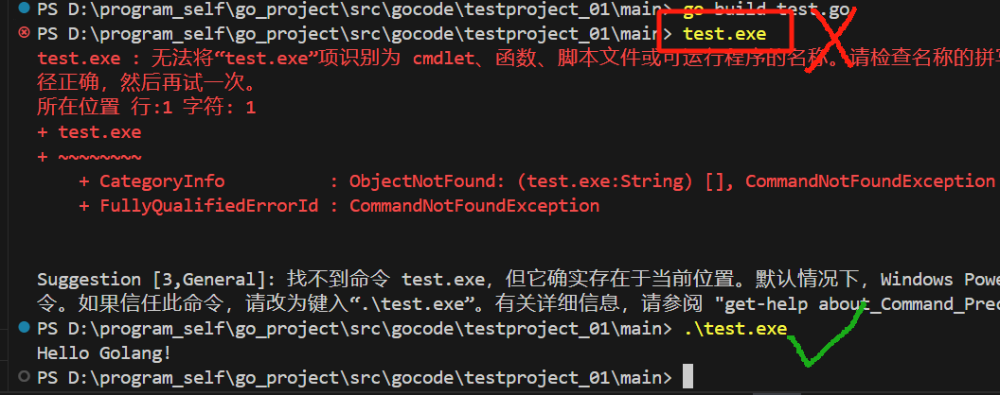

# 简介

go语言，golang，简称go

学好go语言，能就业以下的职业岗位


# sdk下载

https://studygolang.com/dl去这个网站下载sdk go  我这里下载的是1.22.0版本

这里我直接下载了go的压缩包，直接解压使用：


## 安装配置

这里我附了一个链接，可以看下这个md文档的相对目录下有这个sdk压缩包 [go1.22.0.windows-amd64.zip](go_sdk\go1.22.0.windows-amd64.zip) 


下面是go sdk的目录结构，两个常见的目录，一个是api一个是bin


## 验证目录下的go.exe是否可用

查看sdk是否安装成功，go version看下go的sdk的版本是否能识别到

## 配置系统环境变量全局使用

将这个go sdk的bin目录放置到系统环境变量path里面  我本机上的路径为

```bash
D:\program_self\sdk\golang\go\bin
```

如果是在其他电脑上的话自行根据路径填写即可

# 第一行代码

## 代码层级结构

我创建一个工作空间和项目的文件夹，注意层级要分明，如下：


## 代码

创建go源文件，test.go：


```go
package main  //声明文件所在的包，每个go文件必须有归属的包
import "fmt"  //引入程序中需要用到的包，为了使用这个包下的函数 比如Printlin函数
func main(){  //程序入口主函数
	fmt.Println("Hello Golang!") //打印控制台
}
```

## 编译

对源文件test.go进行编译：go build 

```bash
go build .go文件路径
```

这里执行完成之后本地有报错，如下：(这里是我本地找路径找错了，其实没有这个报错，可以直接不需要管，如果后面遇到了再看这个错误怎么解决，我是直接按照go build .go文件路径来编译的，最后生成了对应的可执行文件)

> 
>
> 网上查了资料原来是需要使用go.mod文件，所以按照网上的操作了下
>
> 
>
> ```bash
> go env -w GO111MODULE=on
> go mod init xxx //xxx代表文件夹名
> ```


## 执行

然后我们执行这个`test.exe`，注意这里不要直接输入`test.exe`否则会报错  需要用`.\test.exe`来执行才不会报错，如下图所示：



## 编译&执行

上面这个过程执行了两步操作，分别是编译+执行可执行程序两步，但是我们可以通过一个整合的命令执行整个过程，但是并不建议用下面这个方式，因为最好是分部走，理解下编译和运行的过程

```bash
go run test.go
```

## 二者区别

两者的流程图如下：


二者的区别：

1. 在编译时，编译器会将程序运行依赖的库文件包含在可执行文件中，所以，可执行文件变大了很多。

   

2. 如果我们先编译生成了可执行文件，那么我们可以将该可执行文件烤贝到没有go开发环境的机器上，仍然可以运行

3. 如果我们是直接go run go源代码，那么如果要在另外一个机器上这么运行，也需要go开发环境，否则无法执行。

编译的注意事项：

编译后的文件可以另外指定名称：


